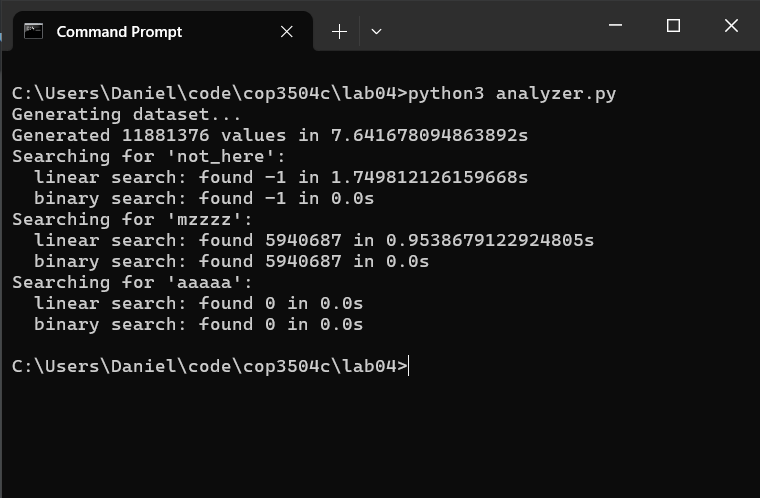

= Lab 04: Time Complexity & Profiling

CPU: 11th Gen Intel Core i5-1145G7 @ 2.60GHz, 4 cores

1. Why is a search for `"not_here"` the worst-case for linear search and binary search?
+
`"not_here"` is not in the list, so the linear search traverses the entire list
before deciding the element is not present.
The binary search must also perform the maximum number of comparisons,
splitting the list in half until no possible matches are left.

2. Why is a search for `"mzzzz"` the average-case for linear search?
+
`"mzzzz"` happens to be near the exact center of the list,
so the linear search algorithm must traverse half of the list before finding it.
This is halfway between the best-case scenario
(the element is at the beginning of the list),
and the worst-case scenario
(the algorithm searches the entire list and does not find the element).

3. Why is a search for `"aaaaa"` the best-case for linear search?
+
`"aaaaa"` is at the very beginning of the list,
so the linear search algorithm finds it immediately.

4. How do the results you saw compare to the Big-O complexity for these algorithms?
+
The linear search has a complexity of `O(n)`, which means the average search time
is approximately proportional to the length of the list.
The long time it takes for the linear search to complete in some cases
is appropriate for the large size of the dataset.
+
The binary search has a complexity of `O(log(n))`, which means the average search time
increases logarithmically with the length of the list.
This is because only one additional comparison is needed
each time the length of the list is doubled.
Even with such a large dataset, the algorithm is able to finish in a relatively short time.

5. Why do the binary search results appear so similar,
while the linear search results are so divergent?
+
The binary search always starts with the middle element and jumps around,
so the position of the element in the list has no bearing
on how long the algorithm will take.
Furthermore, the algorithm executes too fast on my processor for the `time()` function
to detect a difference.
In contrast, the linear search begins at the beginning of the list,
so earlier elements are found earlier while later elements take more time to find.
